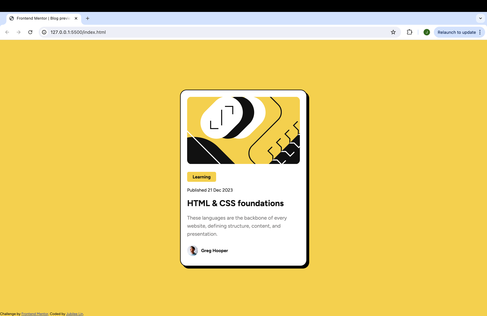

# Frontend Mentor - Blog preview card solution

This is a solution to the [Blog preview card challenge on Frontend Mentor](https://www.frontendmentor.io/challenges/blog-preview-card-ckPaj01IcS). Frontend Mentor challenges help you improve your coding skills by building realistic projects. 

## Table of contents

- [Overview](#overview)
  - [The challenge](#the-challenge)
  - [Screenshot](#screenshot)
  - [Links](#links)
  - [Built with](#built-with)
  - [What I learned](#what-i-learned)
  - [Continued development](#continued-development)
  - [Useful resources](#useful-resources)
- [Author](#author)

## Overview

### The challenge

Users should be able to:

- See hover and focus states for all interactive elements on the page

### Screenshot

### Links

- Solution URL ( https://jubileelin.github.io/Blog-Preview-Card/)

### Built with

- Semantic HTML5 markup
- CSS custom properties
- Flexbox

### What I learned

There was not much that I struggled with in this challenge. I was able to apply the knowledge I had gained from last challenge and easily complete this one within a reasonable time frame. 

### Continued development

I would like to be able to more effectively use proper HTML semantics so that my work can properly be translated into a team or collaborative setting. 

### Useful resources

- [Video Resource](https://youtu.be/G3e-cpL7ofc?si=k_37wGK1nX8Mj4BM) - This is how I learned the basics of HTML and CSS. I hope I can continue to expand on this knowledge as I work through more challenges and eventually develop my own designs.

## Author
- Frontend Mentor - [@jubileelin](https://www.frontendmentor.io/profile/jubileelin)
